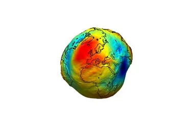
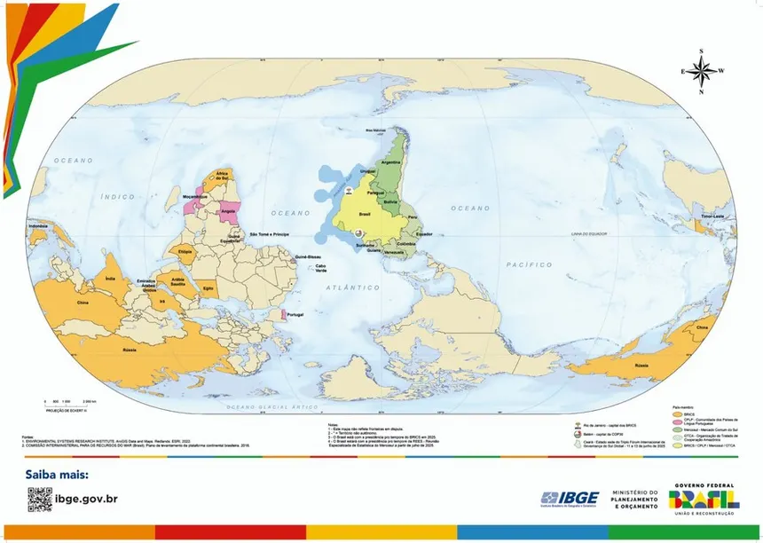
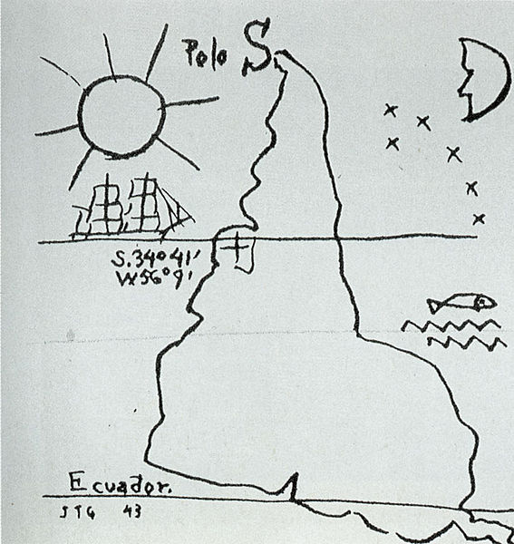

```{python}
#| include: false
import numpy as np
import matplotlib.pyplot as plt
import geopandas as gpd
import pyproj
import cartopy.crs as ccrs
import cartopy.feature as cfeature
import geobr
import h3
from shapely.geometry import Polygon
```

::: {.callout-tip appearance="simple"}
Prefere rodar tudo num notebook em vez de acompanhar pelo site? [](https://colab.research.google.com/github/ftl-brazil-2026/ebook/blob/main/fundamentals_gis_rs/week1/AUX_week1.ipynb) abre o `AUX_week1.ipynb` -- todo o conteúdo (texto e código) da Semana 1 num único notebook.
:::

## Qual o nosso sistema de referência? Todos os pontos precisam de contexto?

Uma ponto coordenada como `(-27, -48)` não significa nada sozinho. Precisamos saber se estamos falando de graus ou metros, a qual sistema de coordenadas esse ponto se refere? E podemos mergulhar mais a fundo sobre qual o elipsoide estamos usando?

### Motivação

- Como localizar objetos na Terra?
- Onde definimos o centro de um eixo?
- O que define norte e sul?

::: {.callout-tip appearance="simple"}
Assim como "10" não quer dizer nada sem uma unidade (10 metros? 10 reais? 10 graus?), uma coordenada não quer dizer nada sem um **Sistema de Referência de Coordenadas** (CRS). O contexto serve para definir a origem, a unidade e o modelo da Terra utilizado em nossa representação.
:::

## A Terra não é uma esfera perfeita

{fig-align="center"}

Um sistema de coordenadas (CRS) define como as representações gráficas nas ferramentas GIS estão localizadas e posicionadas no planeta Terra. Portanto, se partimos da presunção de que a Terra é uma esfera perfeita, poderíamos correlacionar esse ponto com a perspectiva de um ponto tangenciando uma esfera.

```{python}
import numpy as np
import plotly.graph_objects as go

R = 1.0

theta = np.pi / 4
phi = np.pi / 3

x0 = R * np.sin(theta) * np.cos(phi)
y0 = R * np.sin(theta) * np.sin(phi)
z0 = R * np.cos(theta)

u = np.linspace(0, 2*np.pi, 80)
v = np.linspace(0, np.pi, 80)

x = R * np.outer(np.cos(u), np.sin(v))
y = R * np.outer(np.sin(u), np.sin(v))
z = R * np.outer(np.ones_like(u), np.cos(v))

sphere = go.Surface(
    x=x, y=y, z=z,
    opacity=0.4,
    colorscale="Blues",
    showscale=False
)

vector = go.Scatter3d(
    x=[0, x0],
    y=[0, y0],
    z=[0, z0],
    mode="lines+markers",
    line=dict(color="red", width=6),
    marker=dict(size=4),
    name="vetor r"
)

point = go.Scatter3d(
    x=[x0],
    y=[y0],
    z=[z0],
    mode="markers",
    marker=dict(size=6, color="red"),
)

L = 1.5 * R

axes = [
    go.Scatter3d(x=[-L, L], y=[0, 0], z=[0, 0],
                 mode="lines", line=dict(color="black", width=4)),
    go.Scatter3d(x=[0, 0], y=[-L, L], z=[0, 0],
                 mode="lines", line=dict(color="black", width=4)),
    go.Scatter3d(x=[0, 0], y=[0, 0], z=[-L, L],
                 mode="lines", line=dict(color="black", width=4)),
]

layout = go.Layout(
    scene=dict(
        xaxis=dict(title="X", showbackground=True),
        yaxis=dict(title="Y", showbackground=True),
        zaxis=dict(title="Z", showbackground=True),
        aspectmode="cube"
    ),
    margin=dict(l=0, r=0, b=0, t=0)
)

fig = go.Figure(data=[sphere, vector, point] + axes, layout=layout)
fig.show()
```

Bom... considerando que a Terra é redonda. Contudo, os dados mostram que o formato da Terra não é exatamente esférico. Sendo ela denominada como um um **elipsoide de revolução** ou **geóide**. Contudo, nem todo elipsóide se ajusta igualmente em todos os cantos do globo, dessa forma, um elipsóide ajusta para a América do Sul pode ser diferente de um ajustado para a Ásia central. Assim, cada um desses ajustes ocasiona um **Datum**. Datum é um modelo matemático que ancora o sistema de coordenadas na Terra. É exatamente por isso que existem vários "WGS84 da vida": cada datum é uma tentativa diferente de responder "onde exatamente essa esfera imaginária encosta no planeta real?

{fig-align="center"}

[Animação da Representação do Geoide](https://www.esa.int/ESA_Multimedia/Videos/2021/03/The_geoid) — ESA

Portanto, esse sistema de referência define padrões e afinidades que permitem localizar um ponto em qualquer lugar da Terra.

::: {.callout-note appearance="simple"}
## Conversão vs. transformação

- **Conversão** : trocar de projeção mantendo o mesmo datum. Pura matemática, sem perda, 100% reversível.
- **Transformação** : trocar de datum. Envolve modelos ajustados empiricamente e pode introduzir alguns metros de incerteza.
:::

## CRS Geográfico vs. Projetado

|   | **CRS Geográfico** | **CRS Projetado** |
|------------------------|------------------------|------------------------|
| Unidade | graus (°) | metros (normalmente) |
| Exemplo | WGS84 (EPSG:4326), SIRGAS2000 (EPSG:4674) | SIRGAS2000 / UTM 22S (EPSG:31982) |
| Bom para | dado global, web mapping, GPS | medir distância/área, análise local |
| Problema | 1° de longitude ≠ 1° de latitude em distância real | só é preciso perto do seu centro/zona |

Um grau de latitude vale sempre \~111 km em qualquer lugar do planeta. Um grau de **longitude**, não — vale \~111 km no equador e encolhe até virar zero nos polos. É por isso que fazer conta de distância/área direto em graus dá resultado errado (a gente mostra isso mais abaixo, na prática).

::: {.callout-important appearance="simple"}
Não existe projeção sem distorção. Toda projeção sacrifica alguma propriedade, seja ela área, ângulo (forma), distância, etc. A pergunta que nos cabe é qual a projeção para a análise que desejamos executar? Contando que não existe uma projeção "correta".
:::

## Planet Terra em três projeções diferentes.

Os mesmos dados, formas muito diferentes, a projeção é uma decisão analítica, não apenas estética, quiçá política.

```{python}
#| label: fig-africa
#| fig-cap: "O mundo em três projeções: PlateCarree (geográfica), Mercator e Mollweide (equivalente em área)."

world = gpd.read_file(
    "https://naturalearth.s3.amazonaws.com/110m_cultural/ne_110m_admin_0_countries.zip"
)

projections = [
    (ccrs.PlateCarree(),   'PlateCarree — Geográfica',          '#457b9d'),
    (ccrs.Mercator(),      'Mercator — Conformal',               '#f4a261'),
    (ccrs.Mollweide(),     'Mollweide — Equivalente em Área',  '#e63946'),
]

fig, axes = plt.subplots(
    1, 3, figsize=(15, 6),
    subplot_kw={'projection': None}
)

for i, (proj, title, color) in enumerate(projections):
    ax = fig.add_subplot(1, 3, i + 1, projection=proj)
    ax.set_global()
    ax.add_feature(cfeature.OCEAN, facecolor='#e8f4f8')
    ax.add_feature(cfeature.LAND,  facecolor='#f0f0f0')
    for geom in world.geometry:
        ax.add_geometries(
            [geom], ccrs.PlateCarree(),
            facecolor=color, edgecolor='white', linewidth=0.5
        )
    ax.set_title(title, fontsize=11, fontweight='bold', pad=10)

plt.tight_layout()
plt.show()

```

{fig-align="center"}

### Fun Fact

A bandeira da ONU é uma projeção equidistante.

```{python}
from matplotlib.patches import PathPatch
import matplotlib.path
import matplotlib.pyplot as plt
import matplotlib.ticker
from matplotlib.transforms import Bbox, BboxTransform
import numpy as np

import cartopy.crs as ccrs
import cartopy.feature as cfeature


# When drawing the flag, we can either use white filled land, or be a little
# more fancy and use the Natural Earth shaded relief imagery.
filled_land = True


blue = '#4b92db'

# We're drawing a flag with a 3:5 aspect ratio.
fig = plt.figure(figsize=[7.5, 4.5], facecolor=blue)
# Put a blue background on the figure.
blue_background = PathPatch(matplotlib.path.Path.unit_rectangle(),
                            transform=fig.transFigure, color=blue,
                            zorder=-1)
fig.patches.append(blue_background)

# Set up the Azimuthal Equidistant and Plate Carree projections
# for later use.
az_eq = ccrs.AzimuthalEquidistant(central_latitude=90)
pc = ccrs.PlateCarree()

# Pick a suitable location for the map (which is in an Azimuthal
# Equidistant projection).
ax = fig.add_axes([0.25, 0.24, 0.5, 0.54], projection=az_eq)

# The background patch is not needed in this example.
ax.patch.set_facecolor('none')
# The Axes frame produces the outer meridian line.
for spine in ax.spines.values():
    spine.update({'edgecolor': 'white', 'linewidth': 2})

# We want the map to go down to -60 degrees latitude.
ax.set_extent([-180, 180, -60, 90], ccrs.PlateCarree())

# Importantly, we want the axes to be circular at the -60 latitude
# rather than cartopy's default behaviour of zooming in and becoming
# square.
_, patch_radius = az_eq.transform_point(0, -60, pc)
circular_path = matplotlib.path.Path.circle(0, patch_radius)
ax.set_boundary(circular_path)

if filled_land:
    ax.add_feature(
        cfeature.LAND, facecolor='white', edgecolor='none')
else:
    ax.stock_img()

gl = ax.gridlines(crs=pc, linewidth=2, color='white', linestyle='-')
# Meridians every 45 degrees, and 4 parallels.
gl.xlocator = matplotlib.ticker.FixedLocator(np.arange(-180, 181, 45))
parallels = np.arange(-30, 70, 30)
gl.ylocator = matplotlib.ticker.FixedLocator(parallels)


plt.show()


```

## Projeções - Sistema UTM - Universal Transverse Mercator

O Sistema de Coordenadas Universal Transverso de Mercator (UTM) tem sua origem no equador em uma longitude específica. Para diminuir distorções, o mundo é dividido em 60 zonas com 6 graus de comprimento em longitude. As zonas são numeradas entre 1 e 60, em ordem respectiva de oeste a leste.

```{python}
import matplotlib.pyplot as plt
import cartopy.crs as ccrs

# Create a list of integers from 1 - 60
zones = range(1, 61)

# Create a figure
fig = plt.figure(figsize=(18, 6))

# Loop through each zone in the list
for zone in zones:

    # Add GeoAxes object with specific UTM zone projection to the figure
    ax = fig.add_subplot(1, 
                        len(zones), 
                        zone,
                        projection=ccrs.UTM(zone=zone,
                                            southern_hemisphere=True)
                                            )

    # Add coastlines, gridlines and zone number for the subplot
    ax.coastlines(resolution='110m')
    ax.gridlines()
    ax.set_title(zone)

# Add a supertitle for the figure
fig.suptitle("UTM Projection - Zones")

# Display the figure
plt.show()
```

::: {.callout-note appearance="simple"}
## Nada novo sob o sol

Pequeno gafanhoto sempre existirá algum website ou projeto que alguém já criou e que facilita a sua vida.

- **Mapa UTM** - [UTM MAPA](https://www.dmap.co.uk/utmworld.htm)
- **Matemática por trás** - [UTM Glossario](https://www.tarmacview.com/glossary/utm/)
- **BOM DEMAIS** - [Diversas projecoes](https://www.geo-projections.com/)
- **EPSG.IO** - [EPSG - **Brabo dos brabo**](https://epsg.io/)
- **Map4s3** - [Salvador da Patria](https://map4s3.com.br/maps/br_utm/)
:::

## Como podemos reprojetar os dados geoespaciais?

Uma das formas mais clássicas e tradicionais de manipular dados geoespaciais é usando o projeto robusto e estável GDAL.[GDAL-WEBSITE](https://gdal.org/en/stable/). GDAL é a engine rodando por debaixo dos panos de muitos softwares mundo a fora, como por exemplo o nosso querido QGIS. Tudo o que você imagina que é possível fazer, em termos de manipulação de dados geoespaciais como vetores e raster, muito provavelmente alguém já vai ter feito com GDAL. Extremamente completa e poderosa, a biblioteca conta com Open Source Licence e uma comunidade engajada, que promove um dos maiores eventos geoespaciais do mundo: [FOSS4G](https://2026.foss4g.org/en/).

Para ilustrarmos esses conceitos de transformação dos dados e reprojeções, utilizaremos uma engine que trabalha por debaixo dos panos no GDAL para transformar os dados, chamada [PROJ](https://proj.org/en/stable/). Contudo, vamos abordar suas bindings em Python.

## `pyproj` por baixo dos panos

`pyproj` é a biblioteca Python que fala com o [PROJ](https://proj.org/), o motor de transformação de coordenadas usado por praticamente todo o ecossistema geoespacial (QGIS, GDAL, GeoPandas, Cartopy, e lá vai pedrada). A classe `Transformer` converte um ponto de um CRS para outro:

```{python}
transformer = pyproj.Transformer.from_crs(
    "EPSG:4326",   # WGS84, geográfico
    "EPSG:31982",  # SIRGAS2000 / UTM zone 22S
    always_xy=True,
)

lon, lat = -48.5495, -27.5973  # Florianópolis
x, y = transformer.transform(lon, lat)
print(f"Geográfico:  {lon:.4f}°, {lat:.4f}°")
print(f"Projetado:   x={x:,.1f} m, y={y:,.1f} m")
```

Repare: saímos de graus e chegamos em metros a partir de uma origem arbitrária da zona UTM, é isso que uma projeção faz, ponto a ponto.

### Visualizando a distorção

Uma forma direta de *ver* o que uma projeção faz é pegar uma grade regular de meridianos (longitude) e paralelos (latitude) (em graus) e observar como ela fica depois de projetada.

```{python}
#| label: fig-grid-warp
#| fig-cap: "Uma grade regular de 5° em graus (esquerda) e a mesma grade depois de projetada para uma única zona UTM (direita). Longe do meridiano central da zona, a distorção explode, é exatamente por isso que UTM é dividido em zonas estreitas."

lons = np.arange(-75, -30, 5)
lats = np.arange(-35, 10, 5)

to_utm = pyproj.Transformer.from_crs("EPSG:4326", 
                                    "EPSG:31982", 
                                    always_xy=True
                                    )

fig, axes = plt.subplots(1, 2, figsize=(13, 6))

# grade original, em graus
ax = axes[0]
for lon in lons:
    ax.plot([lon] * len(lats), lats, color="#457b9d", linewidth=0.8)
for lat in lats:
    ax.plot(lons, [lat] * len(lons), color="#457b9d", linewidth=0.8)
ax.set_title("Grade geográfica (graus)")
ax.set_xlabel("longitude")
ax.set_ylabel("latitude")
ax.set_aspect("equal")

# a mesma grade, projetada pra uma única zona UTM (22S)
ax = axes[1]
for lon in lons:
    lat_line = np.linspace(-35, 10, 60)
    x, y = to_utm.transform([lon] * len(lat_line), lat_line)
    ax.plot(x, y, color="#e63946", linewidth=0.8)
for lat in lats:
    lon_line = np.linspace(-75, -30, 60)
    x, y = to_utm.transform(lon_line, [lat] * len(lon_line))
    ax.plot(x, y, color="#e63946", linewidth=0.8)
ax.set_title("Mesma grade, projetada (UTM 22S)")
ax.set_xlabel("x (m)")
ax.set_ylabel("y (m)")
ax.set_aspect("equal")

plt.tight_layout()
plt.show()
```

A grade projetada deforma conforme se afasta do meridiano central da zona 22S. E isso não é é um bug, mas sim a consequência da projeção. Isso nos leva a compreender o fato de UTM ser dividida em 60 zonas estreitas de 6° cada. Dessa forma, cada zona só é precisa perto do seu próprio centro.

## Visualizando com Cartopy

Os mesmos dados, três projeções, três decisões diferentes sobre a américa do sul:

```{python}
#| label: fig-projections
#| fig-cap: "PlateCarree (geográfica, sem correção nenhuma), Mercator (conforme — preserva ângulos, mas distorce área longe do equador) e Albers Equal Area centrada no Brasil (preserva área)."

projections = [
    (ccrs.PlateCarree(), "PlateCarree — geográfica"),
    (ccrs.Mercator(), "Mercator — conforme"),
    (ccrs.AlbersEqualArea(central_longitude=-50, 
                            central_latitude=-20), "Albers — área equivalente"),
]

fig = plt.figure(figsize=(15, 5))
for i, (proj, title) in enumerate(projections, start=1):
    ax = fig.add_subplot(1, 3, i, projection=proj)
    ax.set_extent([-85, -30, -50, 20], 
                    crs=ccrs.PlateCarree()
                    )
    ax.add_feature(cfeature.LAND, facecolor="#f0f0f0")
    ax.add_feature(cfeature.OCEAN, facecolor="#e8f4f8")
    ax.add_feature(cfeature.BORDERS, linewidth=0.5)
    ax.coastlines(linewidth=0.6)
    ax.set_title(title, fontsize=11, fontweight="bold")

plt.tight_layout()
plt.show()
```

### Aprofundando os mapas geográficos em python

#### Gridlines e rótulos

O [Cartopy](https://cartopy.readthedocs.io/stable/) será nosso carro chefe aqui para realizar mapas estáticos. Ele tem funcionalidades para tudo. Aqui exploraremos como desenhar os meridianos e paralelos com rótulo direto no eixo.

```{python}
#| label: fig-gridliner
#| fig-cap: "Gridlines com rótulos automáticos de latitude/longitude sobre o Brasil."

fig = plt.figure(figsize=(7, 7))
ax = fig.add_subplot(1, 1, 1, projection=ccrs.PlateCarree())
ax.set_extent([-75, -33, -34, 6], crs=ccrs.PlateCarree())
ax.add_feature(cfeature.LAND, facecolor="#f0f0f0")
ax.add_feature(cfeature.OCEAN, facecolor="#e8f4f8")
ax.coastlines(linewidth=0.6)

gl = ax.gridlines(draw_labels=True, linewidth=0.5, color="gray", alpha=0.6)
gl.top_labels = False
gl.right_labels = False

ax.set_title("Brasil com gridlines rotuladas", fontsize=12, fontweight="bold")
plt.show()
```

::: {.callout-note appearance="simple"}
TIP: - Onde conseguir dados de delineação dos países? A referência é sempre utilizar [Natural Earth Data](https://www.naturalearthdata.com/about/).

Geopandas tem uma integração direta com eles no: [Geodatasets](https://geodatasets.readthedocs.io/en/latest/). No R, a biblioteca é melhor estruturada: [R Natural Earth](https://ropensci.github.io/rnaturalearth/)
:::

## Reprojeção: vetor vs. raster

Quando pensamos nos tipos de dados geoespaciais, a reprojeção dos dois tipos não é a mesma coisa. Quando temos uma matriz de dados (raster) precisamos reprojetar e reamostrar os valores dessa matriz dentro de um novo sistema de coordenadas.

Olhemos com mais calma:

- **Vetor** : cada vértice é um ponto, e um ponto vira outro ponto direto pela fórmula de transformação.
- **Raster**: reprojetar significa criar uma grade *nova*, com pixels em posições diferentes, e daí **re-amostrar** (interpolar) os valores originais pra essa grade nova. É mais trabalho computacional e costuma perder um pouco de informação. Então ai vai uma dica: Quando você estiver trabalhando com dados de vetores e raster, tente, sempre que possível, reprojetar os vetores pro CRS do raster, e não o contrário.

### Vetor: Não existe área em graus.

Um dos erros mais comuns de quem está começando a manipular dados geoespaciais é calcular a área utilizando um sistema geográfico em graus, ao invés de sua projeção.

```{python}
sc = geobr.read_state(code_state="SC", year=2020)

area_graus = sc.geometry.area.iloc[0]          # em graus² -- quer dizer porra nenhuma 

# primeiro se reprojetada para uma projecao UTM na zona da area de interesse 
area_km2 = sc.to_crs(31982).geometry.area.iloc[0] / 1e6  # reprojetado pra metros, depois km²

print(f"Área 'calculada' direto em graus:  {area_graus:.4f} (sem unidade real, inútil)")
print(f"Área depois de reprojetar (UTM):   {area_km2:,.0f} km²")
```

O primeiro número não é "um pouco impreciso", ele basicamente representa área nenhuma, porque grau² não é uma unidade de área na superfície da Terra. Só depois de reprojetar pra um CRS em metros a conta passa a fazer sentido.

### Raster: A ordem das operações

Ao desenhar um raster reprojetado com Cartopy, o `ax.set_extent()` precisa vir **antes** do `imshow()`, senão o cálculo de reamostragem usa a extensão errada. Muitas vezes você vai estar plotando certo mas não configurando a extensão visível no seu mapa.

```{python}
#| label: fig-raster-reproj
#| fig-cap: "Mesmo raster sintético, mesma projeção de destino (RotatedPole) — a diferença entre os dois painéis é só a ORDEM de chamada do set_extent()."

img = np.linspace(0, 1, 10_000).reshape(100, 100)

img_extent = (-49.5, -48.0, -28.2, -27.0)  # bbox perto de Florianópolis/SC
img_proj = ccrs.PlateCarree()

map_proj = ccrs.RotatedPole(pole_longitude=120.0,                           pole_latitude=70.0
)
map_extent = (-50.0, -47.5, -28.6, -26.6)

fig, axs = plt.subplots(
    1, 2, figsize=(11, 5), subplot_kw={"projection": map_proj},
    sharex=True, sharey=True, layout="constrained",
)

axs[0].set_title("✗ imshow ANTES do set_extent")
axs[0].imshow(img, extent=img_extent, 
                    origin="lower", transform=img_proj, 
                    cmap="viridis"
                    )
axs[0].set_extent(map_extent, 
                crs=img_proj
                )

axs[1].set_title("✓ imshow DEPOIS do set_extent")
axs[1].set_extent(map_extent, 
                    crs=img_proj
                    )
axs[1].imshow(img, extent=img_extent, origin="lower", transform=img_proj, cmap="viridis")

for ax in axs:
    ax.coastlines(linewidth=0.6)
    ax.gridlines(draw_labels=False, linewidth=0.3)

plt.show()
```

## SIRGAS - Padrão Brasileiro

**SIRGAS2000** (Sistema de Referência Geocêntrico para as Américas) é o datum oficial do Brasil desde 2005 (IBGE), substituindo os antigos SAD69 e Córrego Alegre. É geocêntrico, compatível com GPS/WGS84 na prática (as diferenças são de centímetros, não de metros), e é o que toda base oficial do IBGE — incluindo os dados do `geobr` que usamos nos notebooks anteriores, já vem por padrão (`EPSG:4674`).

Como o Brasil é largo demais pra uma única zona UTM, o território é coberto por várias zonas SIRGAS2000/UTM, uma a cada 6° de longitude. Da mesma forma que existe WGS84/UTM também existe SIRGAS2000/UTM, como formas projetadas do sistema de referencia.

Abaixo, vamos colorir cada estado pela UTM de seu centróide.

```{python}
#| label: fig-utm-zones
#| fig-cap: "Estados brasileiros coloridos pela zona UTM do centroide de cada um, com as linhas tracejadas marcando os limites de cada zona (meridianos a cada 6°). Note como estados largos (como o Amazonas) cruzam mais de uma zona -- na prática, escolhe-se a zona mais próxima do centro da área de interesse."

states = geobr.read_state(year=2020)
states["utm_zone"] = states.geometry.centroid.x.apply(lambda lon: int((lon + 180) // 6) + 1)

fig, ax = plt.subplots(figsize=(7, 8))
states.plot(
    ax=ax,
    column="utm_zone",
    categorical=True,
    cmap="tab10",
    edgecolor="white",
    linewidth=0.6,
    legend=True,
    legend_kwds={"title": "Zona UTM", "loc": "lower left"},
)

minx, miny, maxx, maxy = states.total_bounds
zone_min, zone_max = int(states["utm_zone"].min()), int(states["utm_zone"].max())
for zone in range(zone_min, zone_max + 2):
    lon = -180 + 6 * (zone - 1)  # limite oeste da zona
    if minx - 1 <= lon <= maxx + 1:
        ax.axvline(lon, color="black", linewidth=0.7, linestyle="--", alpha=0.5)
        if lon < maxx:
            ax.text(lon + 0.3, maxy + 0.3, f"{zone}", fontsize=8, ha="left", va="bottom")

ax.set_xlim(minx - 1, maxx + 1)
ax.set_ylim(miny - 1, maxy + 1.5)
ax.set_title("Zonas UTM por estado", fontsize=12, fontweight="bold")
ax.set_axis_off()
plt.show()
```

## Outras Grades Modernas

Existem muito outros grids que surgem como solução para problemas práticos. Um desses é o H3 hexágonos criado pela Uber, que se espalhou como um grid padrão para análises dinâmicas de preço e ta ganhando muita aquisição pela comunidade geoespacial.

::: {.callout-note appearance="simple"}
A partir do minuto 9:30 nesse <https://www.youtube.com/watch?v=ay2uwtRO3QE&t=573s> esse software engineer da Uber discute sobre como chegaram a solução de hexágonos como forma padrão dos grids da Uber.
:::

### Hexágonos - H3

Ao invés de grades quadradas com 4 vizinhos, hexágonos apresentam uma solução para esse problema pertinente. De tal forma como a hipotenusa sempre sendo maior que os catetos, num hexágono todos as distâncias são uniformes entre cada lado. Cada héxagono tem 6 vizinhos, todos a mesma distância do centro. É por isso que virou padrão da indústria pra coisas como precificação dinâmica, densidade de corridas e qualquer análise espacial em escala.

"Squares (like geohash or quadtree grids) have uneven neighbor distances and distort heavily as you move across the map, especially near poles"

```{python}
from matplotlib.patches import Rectangle, RegularPolygon

fig, axes = plt.subplots(1, 2, figsize=(12, 6))

# --- Grade quadrada ---
ax = axes[0]
s = 1.0
for i in range(-2, 3):
    for j in range(-2, 3):
        color = "#f0f0f0" if (i, j) != (0, 0) else "#e63946"
        ax.add_patch(Rectangle((i - s/2, j - s/2), s, s,
                                facecolor=color, edgecolor="white", linewidth=1.5))

orth = [(1, 0), (-1, 0), (0, 1), (0, -1)]
diag = [(1, 1), (1, -1), (-1, 1), (-1, -1)]

for dx, dy in orth:
    ax.plot([0, dx], [0, dy], color="#457b9d", linewidth=2.5, zorder=3)
for dx, dy in diag:
    ax.plot([0, dx], [0, dy], color="#f4a261", linewidth=2.5, zorder=3)

ax.plot(0, 0, "o", color="white", markersize=6, zorder=4)
ax.annotate("1.0", xy=(0.55, 0.08), color="#457b9d", fontsize=11, fontweight="bold")
ax.annotate("√2 ≈ 1.41", xy=(0.55, 0.62), color="#f4a261", fontsize=11, fontweight="bold")

ax.set_xlim(-2.2, 2.2)
ax.set_ylim(-2.2, 2.2)
ax.set_aspect("equal")
ax.set_axis_off()
ax.set_title("Grade quadrada — 2 distâncias diferentes", fontsize=11, fontweight="bold")

# --- Grade hexagonal ---
ax = axes[1]
R = 1.0
offsets_axial = [(1, 0), (1, -1), (0, -1), (-1, 0), (-1, 1), (0, 1), (0, 0)]

def axial_to_xy(q, r, size):
    x = size * np.sqrt(3) * (q + r / 2)
    y = size * 1.5 * r
    return x, y

centers = {(q, r): axial_to_xy(q, r, R) for q, r in offsets_axial}

for (q, r), (x, y) in centers.items():
    color = "#f0f0f0" if (q, r) != (0, 0) else "#e63946"
    hexagon = RegularPolygon((x, y), numVertices=6, radius=R,
                              orientation=0, facecolor=color,
                              edgecolor="white", linewidth=1.5)
    ax.add_patch(hexagon)

cx, cy = centers[(0, 0)]
for (q, r), (x, y) in centers.items():
    if (q, r) != (0, 0):
        ax.plot([cx, x], [cy, y], color="#457b9d", linewidth=2.5, zorder=3)

ax.plot(cx, cy, "o", color="white", markersize=6, zorder=4)
dist = np.sqrt(3) * R
ax.annotate(f"{dist:.2f} (sempre)", xy=(cx + 0.25, cy - 1.65), color="#457b9d",
            fontsize=11, fontweight="bold")

ax.set_xlim(-3.2, 3.2)
ax.set_ylim(-3.2, 3.2)
ax.set_aspect("equal")
ax.set_axis_off()
ax.set_title("Grade hexagonal — 1 distância única", fontsize=11, fontweight="bold")

plt.tight_layout()
plt.show()
```

Hexagons minimize these distortions, preserve area more uniformly, avoid diagonal inconsistencies, and produce cleaner, more natural-looking spatial clusters

É essa uniformidade de distânciA que faz o H3 ser bastante utilizada para análises de vizinhança, roteamento e agregação espacial. Dessa forma, a Uber não precisa se preocupar em "corrigir" a distância dependendo de qual dos vizinhos está sendo comparado.

```{python}
#| label: fig-h3
#| fig-cap: "Florianópolis coberta por hexágonos H3, resolução 8 (~0.7 km² por hexágono)."

muni = geobr.read_municipality(code_muni=4205407, year=2020)  # Florianópolis
geom = muni.geometry.iloc[0]

shape = h3.geo_to_h3shape(geom)
cells = h3.h3shape_to_cells(shape, 8)

hex_polygons = [
    Polygon([(lng, lat) for lat, lng in h3.cell_to_boundary(cell)])
    for cell in cells
]
hex_gdf = gpd.GeoDataFrame({"h3_cell": list(cells)}, geometry=hex_polygons, crs="EPSG:4326")

fig, ax = plt.subplots(figsize=(7, 7))
muni.plot(ax=ax, color="#f0f0f0", edgecolor="#898781", linewidth=1)
hex_gdf.plot(ax=ax, facecolor="none", edgecolor="#e63946", linewidth=0.5)
ax.set_title(f"Florianópolis em {len(hex_gdf)} hexágonos H3 (res. 8)", fontsize=12, fontweight="bold")
ax.set_axis_off()
plt.show()
```

Cada hexágono tem um índice único (`h3_cell`, tipo `88a91bcd51fffff`) que serve como chave pra agregação espacial, só que numa grade uniforme em vez dos limites do IBGE.

### H3 interativo

Um mapa estático mostra a malha, mas esconde como o H3 pode ser útil na prática, onde cada célula é um índice individual em diferentes niveis. Com `folium` (que embrulha a biblioteca JS [Leaflet](https://leafletjs.com/)) dá pra gerar um mapa interativo, passe o mouse sobre qualquer hexágono e veja seu `h3_cell` e uma métrica calculada célula a célula.

Vamos cobrir **Catolé do Rocha**, no sertão da Paraíba.

```{python}
#| label: fig-h3-folium
#| fig-cap: "Catolé do Rocha (PB) coberta por hexágonos H3, resolução 8. Passe o mouse sobre qualquer hexágono pra ver seu índice e a distância até o centro do município."

import folium
import branca.colormap as cm

muni = geobr.read_municipality(code_muni=2504306, year=2020)  # Catolé do Rocha - PB
geom = muni.geometry.iloc[0]
centroid = geom.centroid

shape = h3.geo_to_h3shape(geom)
cells = h3.h3shape_to_cells(shape, 8)

hex_polygons = [
    Polygon([(lng, lat) for lat, lng in h3.cell_to_boundary(cell)])
    for cell in cells
]
hex_gdf = gpd.GeoDataFrame({"h3_cell": list(cells)}, geometry=hex_polygons, crs="EPSG:4326")

# distância de cada centro de hexágono até o centro do município (~km, aproximando 1° ≈ 111km)
hex_gdf["dist_km"] = hex_gdf.geometry.centroid.apply(lambda p: centroid.distance(p) * 111).round(2)

colormap = cm.linear.YlOrRd_09.scale(hex_gdf["dist_km"].min(), hex_gdf["dist_km"].max())
colormap.caption = "Distância ao centro do município (km)"

m = folium.Map(location=[centroid.y, centroid.x], zoom_start=12, tiles="cartodbpositron")

folium.GeoJson(
    muni,
    style_function=lambda _: {"fillOpacity": 0, "color": "#333333", "weight": 2},
).add_to(m)

folium.GeoJson(
    hex_gdf,
    style_function=lambda feat: {
        "fillColor": colormap(feat["properties"]["dist_km"]),
        "color": "white",
        "weight": 0.6,
        "fillOpacity": 0.75,
    },
    highlight_function=lambda _: {"weight": 2, "color": "black"},
    tooltip=folium.GeoJsonTooltip(
        fields=["h3_cell", "dist_km"],
        aliases=["Célula H3:", "Distância ao centro (km):"],
        localize=True,
    ),
).add_to(m)

colormap.add_to(m)
m
```

Repare que a métrica (`dist_km`) foi calculada uma vez por célula e vive junto com o `h3_cell` no `GeoDataFrame` — é exatamente assim que se agrega qualquer variável (densidade populacional, corridas de app, chamadas de emergência...) numa grade H3, uma linha por célula, um índice, um valor.

Reparou algo de errado nesse cálculo? Vamos tentar corrigir...

::: {.callout-note appearance="simple"}
## Tarefa: monte seu próprio mapa de hexágonos

Escolha uma das cidades abaixo (ou outra à sua escolha — busque o `code_muni` no [IBGE](https://www.ibge.gov.br/explica/codigos-dos-municipios.php) ou filtrando `geobr.read_municipality()` pelo nome, como fizemos em @fig-utm-zones) e repita o processo acima:

| Cidade          | UF  | `code_muni` |
|-----------------|-----|-------------|
| Bonito          | MS  | 5002308     |
| Paraty          | RJ  | 3303807     |
| Lençóis         | BA  | 2919207     |
| Bento Gonçalves | RS  | 4302105     |

1.  Baixe o polígono do município com `geobr.read_municipality(code_muni=..., year=2020)`.
2.  Gere as células com `h3.geo_to_h3shape()` e `h3.h3shape_to_cells()` — teste resoluções diferentes (7, 8, 9) e observe como o número de células muda.
3.  Calcule uma métrica por célula: pode ser a distância ao centro (como aqui), a área de cada hexágono, ou até um valor aleatório simulando "densidade".
4.  Monte o mapa com `folium.GeoJson()` e um `GeoJsonTooltip` mostrando `h3_cell` e a métrica escolhida.

Compare com um colega que escolheu outra cidade: o número de hexágonos muda muito entre uma cidade pequena e uma grande? E a resolução 9 ainda é viável pra um município enorme, ou o mapa fica pesado demais?
:::

## Referências

- Pebesma, E.; Bivand, R. — [Spatial Data Science, cap. 2: Spaces](https://r-spatial.org/book/02-Spaces.html)
- Lovelace, R.; Nowosad, J.; Muenchow, J. — [Geocomputation with R, cap. 7: Reprojecting geographic data](https://r.geocompx.org/reproj-geo-data)
- Cartopy gallery — [Gridlines and tick labels](https://cartopy.readthedocs.io/stable/gallery/gridlines_and_labels/gridliner.html)
- Cartopy gallery — [Raster reprojections](https://cartopy.readthedocs.io/stable/gallery/scalar_data/raster_reprojections.html)
- [H3 — Uber's Hexagonal Hierarchical Spatial Index](https://h3geo.org/)
- Uber - [Uber Blog - Dynamic Prices](https://www.uber.com/us/en/blog/h3/)

{fig-align="left"}